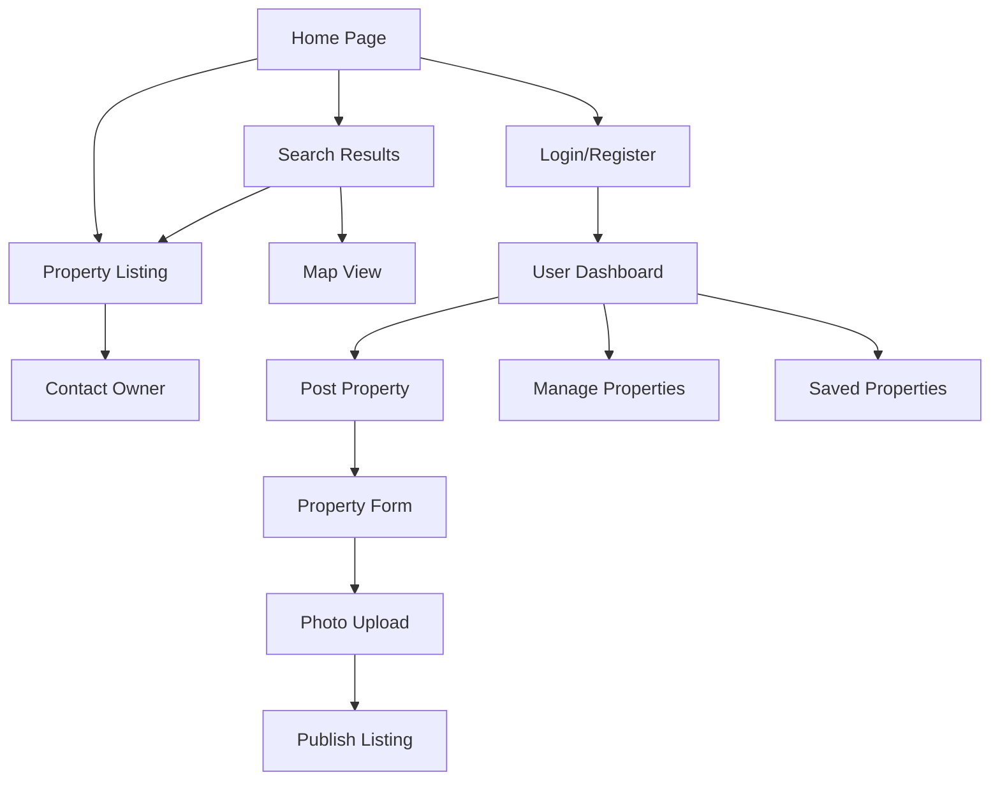

# MojStan - Product Requirements Document

## 1. Product Overview
MojStan is a rental marketplace platform designed specifically for the Serbian market, connecting property owners with potential tenants. The platform enables users to post rental properties and search for available accommodations across Serbia.

The primary goal is to streamline the rental process by providing a centralized, user-friendly platform that serves both landlords seeking tenants and individuals looking for rental properties. MojStan aims to become the leading rental marketplace in Serbia by offering localized features and Serbian language support.

## 2. Core Features

### 2.1 User Roles

| Role | Registration Method | Core Permissions |
|------|---------------------|------------------|
| Property Owner | Email registration with property verification | Can post properties, manage listings, communicate with tenants, view analytics |
| Tenant | Email registration | Can search properties, save favorites, contact owners, submit rental applications |
| Guest User | No registration required | Can browse properties with limited search filters |

### 2.2 Feature Module

Our MojStan platform consists of the following main pages:
1. **Home page**: hero section with search functionality, featured properties, navigation menu, location-based browsing.
2. **Property listing page**: detailed property information, photo gallery, contact form, location map, similar properties.
3. **Search results page**: filtered property listings, map view, sorting options, pagination.
4. **User dashboard**: property management for owners, saved properties for tenants, profile settings.
5. **Post property page**: property details form, photo upload, pricing settings, availability calendar.
6. **Authentication pages**: login, registration, password reset functionality.

### 2.3 Page Details

| Page Name | Module Name | Feature description |
|-----------|-------------|---------------------|
| Home page | Hero section | Display search bar with location, property type, and price filters. Show featured properties carousel |
| Home page | Navigation | Provide main menu with login/register, post property, and user dashboard links |
| Home page | Featured properties | Show 6-8 highlighted rental properties with basic info and quick view option |
| Property listing | Property details | Display comprehensive property information including description, amenities, rules, and specifications |
| Property listing | Photo gallery | Show multiple property images with lightbox view and thumbnail navigation |
| Property listing | Contact form | Enable direct messaging between tenants and property owners with inquiry form |
| Property listing | Location map | Integrate interactive map showing property location and nearby amenities |
| Search results | Property grid | Display filtered properties in card format with key details and favorite option |
| Search results | Filter panel | Provide advanced filters for location, price range, property type, amenities, and availability |
| Search results | Map view | Show properties on interactive map with clustering and popup details |
| User dashboard | Property management | Allow owners to add, edit, delete, and manage their property listings |
| User dashboard | Saved properties | Enable tenants to view and manage their favorite/saved properties |
| User dashboard | Profile settings | Manage user account information, contact details, and notification preferences |
| Post property | Property form | Collect property details including type, location, description, amenities, and rental terms |
| Post property | Photo upload | Enable multiple image upload with drag-and-drop functionality and image preview |
| Post property | Pricing settings | Set rental price, deposit amount, utility costs, and payment terms |
| Authentication | Login/Register | Handle user authentication with email verification and password requirements |

## 3. Core Process

**Property Owner Flow:**
Property owners register on the platform, verify their email, and access their dashboard. They create property listings by filling out detailed forms, uploading photos, and setting rental terms. Once published, they can manage inquiries from potential tenants, update property information, and track listing performance.

**Tenant Flow:**
Tenants can browse properties as guests or register for enhanced features. They use search filters to find suitable properties, view detailed listings, and save favorites. When interested, they contact property owners through the platform's messaging system and can submit rental applications.

**Guest User Flow:**
Guest users can browse the homepage, view featured properties, and perform basic searches. To access advanced features like saving properties or contacting owners, they need to register.

## 4. User Interface Design

### 4.1 Design Style

- **Primary colors**: Deep blue (#1E3A8A) for headers and primary buttons, pure black (#000000) for text and accents
- **Secondary colors**: White (#FFFFFF) for backgrounds, light blue (#EBF4FF) for hover states and highlights
- **Button style**: Rounded corners (8px border-radius) with subtle shadows, blue primary buttons with white text
- **Font**: Modern sans-serif font (Inter or similar), 16px base size for body text, 24px+ for headings
- **Layout style**: Clean card-based design with generous white space, top navigation bar, grid layouts for property listings
- **Icons**: Minimalist line icons in blue or black, property amenity icons, location and contact icons

### 4.2 Page Design Overview

| Page Name | Module Name | UI Elements |
|-----------|-------------|-------------|
| Home page | Hero section | Large background image with overlay, centered search bar with blue accent, white text on dark overlay |
| Home page | Navigation | White background header with blue logo, black text links, blue "Post Property" button |
| Home page | Featured properties | White cards with subtle shadows, blue price tags, black text, hover effects with light blue background |
| Property listing | Property details | White background with black text, blue section headers, organized in two-column layout |
| Property listing | Photo gallery | Full-width image display with thumbnail strip, white navigation arrows on blue background |
| Property listing | Contact form | White form with blue submit button, black labels, blue focus states on inputs |
| Search results | Property grid | White property cards in responsive grid, blue favorite heart icons, black text with blue price highlights |
| Search results | Filter panel | White sidebar with blue filter headers, checkboxes with blue accent color |
| User dashboard | Navigation tabs | Blue active tab with white text, inactive tabs with black text on white background |
| Post property | Form sections | White background with blue section dividers, blue progress indicator, black form labels |

### 4.3 Responsiveness

The platform is designed mobile-first with responsive breakpoints for tablet and desktop. Touch-friendly interface elements with minimum 44px touch targets, swipe gestures for photo galleries, and optimized mobile navigation with hamburger menu. Desktop version features expanded layouts with sidebar filters and multi-column property grids.