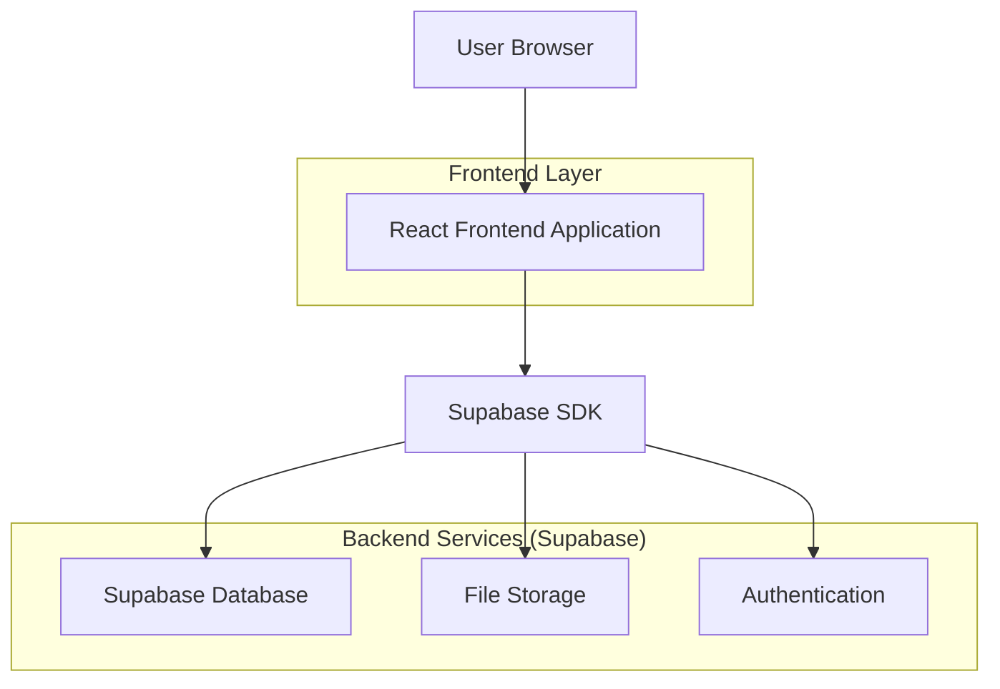
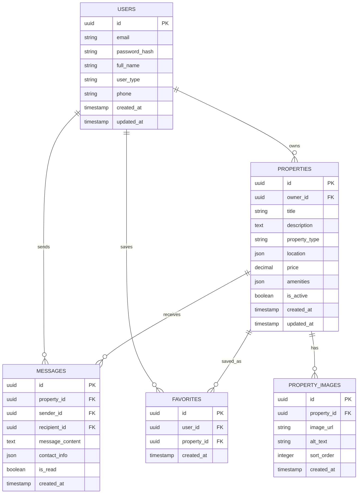

# MojStan - Technical Architecture Document

## 1. Architecture Design



## 2. Technology Description

* Frontend: React\@18 + TypeScript + Tailwind CSS\@3 + Vite

* Backend: Supabase (PostgreSQL database, authentication, file storage)

* Maps Integration: Google Maps API or OpenStreetMap

* Image Processing: Supabase Storage with automatic image optimization

* Deployment: Vercel (frontend) + Supabase (backend services)

## 3. Route Definitions

| Route          | Purpose                                                     |
| -------------- | ----------------------------------------------------------- |
| /              | Home page with search functionality and featured properties |
| /search        | Search results page with filters and map view               |
| /property/:id  | Individual property listing with details and contact form   |
| /login         | User authentication page                                    |
| /register      | User registration page                                      |
| /dashboard     | User dashboard for managing properties and saved listings   |
| /post-property | Form for property owners to create new listings             |
| /profile       | User profile management and settings                        |
| /favorites     | Saved properties for tenants                                |

## 4. API Definitions

### 4.1 Core API

**Property Management**

```
GET /api/properties
```

Request:

| Param Name     | Param Type | isRequired | Description                  |
| -------------- | ---------- | ---------- | ---------------------------- |
| location       | string     | false      | Filter by city or region     |
| property\_type | string     | false      | apartment, house, room, etc. |
| min\_price     | number     | false      | Minimum rental price         |
| max\_price     | number     | false      | Maximum rental price         |
| page           | number     | false      | Pagination page number       |
| limit          | number     | false      | Number of results per page   |

Response:

| Param Name   | Param Type | Description                         |
| ------------ | ---------- | ----------------------------------- |
| properties   | array      | List of property objects            |
| total\_count | number     | Total number of matching properties |
| page         | number     | Current page number                 |

```
POST /api/properties
```

Request:

| Param Name     | Param Type | isRequired | Description                   |
| -------------- | ---------- | ---------- | ----------------------------- |
| title          | string     | true       | Property title                |
| description    | string     | true       | Detailed property description |
| property\_type | string     | true       | Type of property              |
| location       | object     | true       | Address and coordinates       |
| price          | number     | true       | Monthly rental price          |
| images         | array      | true       | Property image URLs           |
| amenities      | array      | false      | List of available amenities   |

Response:

| Param Name   | Param Type | Description                            |
| ------------ | ---------- | -------------------------------------- |
| property\_id | string     | Unique identifier for created property |
| status       | string     | Creation status                        |

**User Authentication**

```
POST /api/auth/register
```

Request:

| Param Name | Param Type | isRequired | Description                      |
| ---------- | ---------- | ---------- | -------------------------------- |
| email      | string     | true       | User email address               |
| password   | string     | true       | User password (min 8 characters) |
| full\_name | string     | true       | User's full name                 |
| user\_type | string     | true       | 'owner' or 'tenant'              |
| phone      | string     | false      | Contact phone number             |

Response:

| Param Name    | Param Type | Description              |
| ------------- | ---------- | ------------------------ |
| user\_id      | string     | Unique user identifier   |
| access\_token | string     | JWT authentication token |
| user\_type    | string     | User role type           |

**Messaging System**

```
POST /api/messages
```

Request:

| Param Name    | Param Type | isRequired | Description             |
| ------------- | ---------- | ---------- | ----------------------- |
| property\_id  | string     | true       | Target property ID      |
| recipient\_id | string     | true       | Property owner ID       |
| message       | string     | true       | Inquiry message content |
| contact\_info | object     | true       | Sender contact details  |

Response:

| Param Name  | Param Type | Description               |
| ----------- | ---------- | ------------------------- |
| message\_id | string     | Unique message identifier |
| status      | string     | Delivery status           |

## 5. Data Model

### 5.1 Data Model Definition



### 5.2 Data Definition Language

**Users Table**

```sql
-- Create users table
CREATE TABLE users (
    id UUID PRIMARY KEY DEFAULT gen_random_uuid(),
    email VARCHAR(255) UNIQUE NOT NULL,
    password_hash VARCHAR(255) NOT NULL,
    full_name VARCHAR(100) NOT NULL,
    user_type VARCHAR(20) DEFAULT 'tenant' CHECK (user_type IN ('owner', 'tenant')),
    phone VARCHAR(20),
    created_at TIMESTAMP WITH TIME ZONE DEFAULT NOW(),
    updated_at TIMESTAMP WITH TIME ZONE DEFAULT NOW()
);

-- Create index
CREATE INDEX idx_users_email ON users(email);
CREATE INDEX idx_users_user_type ON users(user_type);

-- Grant permissions
GRANT SELECT ON users TO anon;
GRANT ALL PRIVILEGES ON users TO authenticated;
```

**Properties Table**

```sql
-- Create properties table
CREATE TABLE properties (
    id UUID PRIMARY KEY DEFAULT gen_random_uuid(),
    owner_id UUID REFERENCES users(id),
    title VARCHAR(200) NOT NULL,
    description TEXT NOT NULL,
    property_type VARCHAR(50) NOT NULL,
    location JSONB NOT NULL,
    price DECIMAL(10,2) NOT NULL,
    amenities JSONB DEFAULT '[]',
    is_active BOOLEAN DEFAULT true,
    created_at TIMESTAMP WITH TIME ZONE DEFAULT NOW(),
    updated_at TIMESTAMP WITH TIME ZONE DEFAULT NOW()
);

-- Create indexes
CREATE INDEX idx_properties_owner_id ON properties(owner_id);
CREATE INDEX idx_properties_property_type ON properties(property_type);
CREATE INDEX idx_properties_price ON properties(price);
CREATE INDEX idx_properties_location ON properties USING GIN(location);
CREATE INDEX idx_properties_is_active ON properties(is_active);

-- Grant permissions
GRANT SELECT ON properties TO anon;
GRANT ALL PRIVILEGES ON properties TO authenticated;
```

**Property Images Table**

```sql
-- Create property_images table
CREATE TABLE property_images (
    id UUID PRIMARY KEY DEFAULT gen_random_uuid(),
    property_id UUID REFERENCES properties(id) ON DELETE CASCADE,
    image_url TEXT NOT NULL,
    alt_text VARCHAR(255),
    sort_order INTEGER DEFAULT 0,
    created_at TIMESTAMP WITH TIME ZONE DEFAULT NOW()
);

-- Create indexes
CREATE INDEX idx_property_images_property_id ON property_images(property_id);
CREATE INDEX idx_property_images_sort_order ON property_images(sort_order);

-- Grant permissions
GRANT SELECT ON property_images TO anon;
GRANT ALL PRIVILEGES ON property_images TO authenticated;
```

**Messages Table**

```sql
-- Create messages table
CREATE TABLE messages (
    id UUID PRIMARY KEY DEFAULT gen_random_uuid(),
    property_id UUID REFERENCES properties(id),
    sender_id UUID REFERENCES users(id),
    recipient_id UUID REFERENCES users(id),
    message_content TEXT NOT NULL,
    contact_info JSONB,
    is_read BOOLEAN DEFAULT false,
    created_at TIMESTAMP WITH TIME ZONE DEFAULT NOW()
);

-- Create indexes
CREATE INDEX idx_messages_property_id ON messages(property_id);
CREATE INDEX idx_messages_sender_id ON messages(sender_id);
CREATE INDEX idx_messages_recipient_id ON messages(recipient_id);
CREATE INDEX idx_messages_created_at ON messages(created_at DESC);

-- Grant permissions
GRANT ALL PRIVILEGES ON messages TO authenticated;
```

**Favorites Table**

```sql
-- Create favorites table
CREATE TABLE favorites (
    id UUID PRIMARY KEY DEFAULT gen_random_uuid(),
    user_id UUID REFERENCES users(id),
    property_id UUID REFERENCES properties(id),
    created_at TIMESTAMP WITH TIME ZONE DEFAULT NOW(),
    UNIQUE(user_id, property_id)
);

-- Create indexes
CREATE INDEX idx_favorites_user_id ON favorites(user_id);
CREATE INDEX idx_favorites_property_id ON favorites(property_id);

-- Grant permissions
GRANT ALL PRIVILEGES ON favorites TO authenticated;
```

**Initial Data**

```sql
-- Insert sample property types and locations
INSERT INTO properties (owner_id, title, description, property_type, location, price, amenities) VALUES
('sample-owner-uuid', 'Moderan stan u centru Beograda', 'Komforan dvosoban stan u srcu grada sa svim potrebnim sadržajima.', 'apartment', '{"address": "Knez Mihailova 15, Beograd", "city": "Beograd", "coordinates": {"lat": 44.8176, "lng": 20.4633}}', 450.00, '["wifi", "parking", "elevator
```

